<p align="center">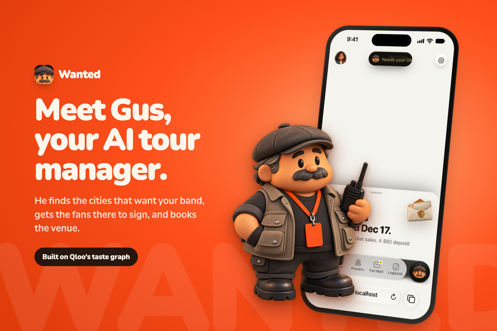</p>

# Wanted

**Gus is an AI tour manager for independent musicians, and he runs on Qloo's taste graph.** He finds the cities where your sound already has fans, puts up a WANTED poster there for them to sign, and once fifty people sign, he asks the venues that fit for a date. He negotiates inside your limits and comes back with one question: yes or no.

Built for the Qloo Agentic Hackathon, "Agents, but with taste."

| | |
|---|---|
| **Try it** | [trywanted.vercel.app/a/maya-ortiz?tour=1](https://trywanted.vercel.app/a/maya-ortiz?tour=1). A 90-second tour from Gus, on a phone or a laptop. No sign-up. |
| **A fan's side** | [trywanted.vercel.app/w/maya-ortiz/burlington-vt](https://trywanted.vercel.app/w/maya-ortiz/burlington-vt) |
| **Gus in Claude or ChatGPT** | Add `https://trywanted.vercel.app/api/mcp` as a custom connector |
| **For AI readers** | [`/llms.txt`](https://trywanted.vercel.app/llms.txt) and [`/llms-full.txt`](https://trywanted.vercel.app/llms-full.txt) |

## Why this matters

A singer-songwriter with 30,000 monthly listeners has fans in two hundred cities and no idea which ten would fill a 150-person venue on a Tuesday.

Without a booking agent, the answer comes from a streaming dashboard, a guess and a few hundred cold emails sent four to six months out. One small venue in western New York counted 50 to 60 booking emails in a single week. The guitarist Eli Winter booked nearly all of about 215 shows himself, out of spreadsheets. So most people never start: in Ditto's survey of 1,500 independent artists, 82% said they couldn't afford to tour and three in four had never toured at all.

The venues are hurting too. NIVA found 64% of independent US stages lost money in 2024. When an act guesses wrong about a city, both of them lose the night.

The fans are already out there. Nobody asks them. Wanted starts with that question, and Gus does the rest of the work.

**Who it's for.** Acts with 5k to 80k monthly listeners, self-managed, playing venues that hold 100 to 400 people, many of them booking their first real tour. So the app skips booking-agent slang and says venue, your cut of ticket sales, and book the date. We start in the Northeast and Midwest, where cities sit close together and small venues are everywhere.

## What Gus does

<p>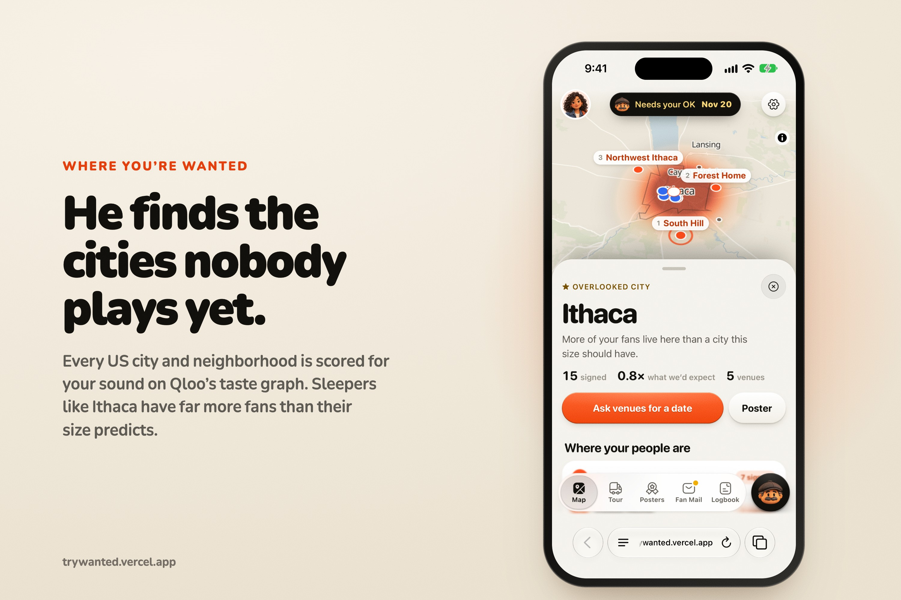 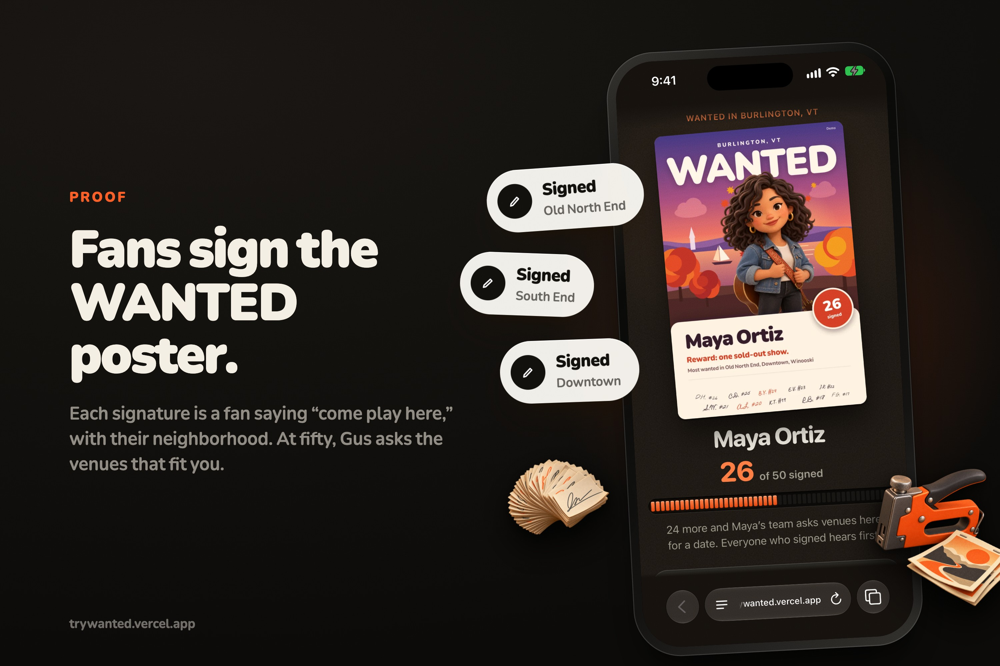</p>
<p>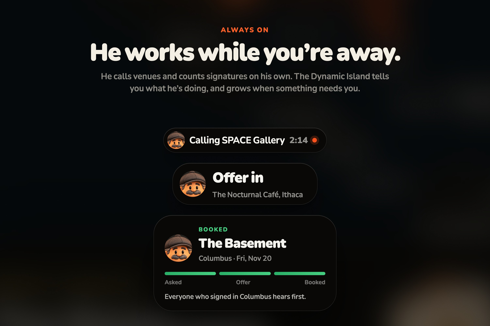 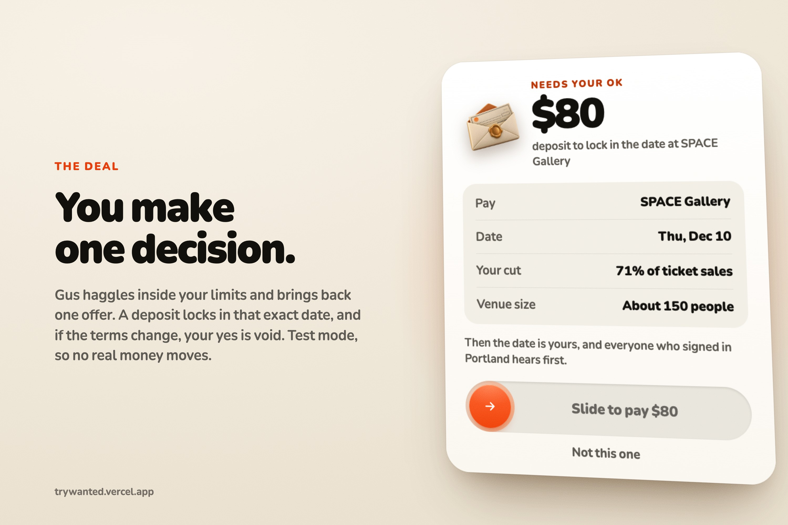</p>

1. **Hears your sound.** Paste a Spotify, Apple Music, Bandcamp or YouTube link. Gus finds you and a few acts you sound like in Qloo.
2. **Finds where you're wanted.** Every US city gets scored for your sound, weighed against twenty other acts so a city isn't hot just because it's big. Sleepers are cities with far more fans than their size predicts.
3. **Puts up a poster.** Fans sign a city's WANTED poster with their neighborhood. Each name checks the prediction.
4. **Asks venues.** At fifty signatures he writes to the venues Qloo ranks for you, skips the ones closed that night, and never goes past your limits.
5. **Brings back one decision.** Say yes and a test deposit locks in that exact offer. If the terms change, your yes is void.
6. **Fills the venue.** Signers hear first and get first dibs on tickets. Posters go where the crowd hangs out, and an opener who shares your crowd gets an invite. After the show he checks the ticket count so you get your full cut.

<p>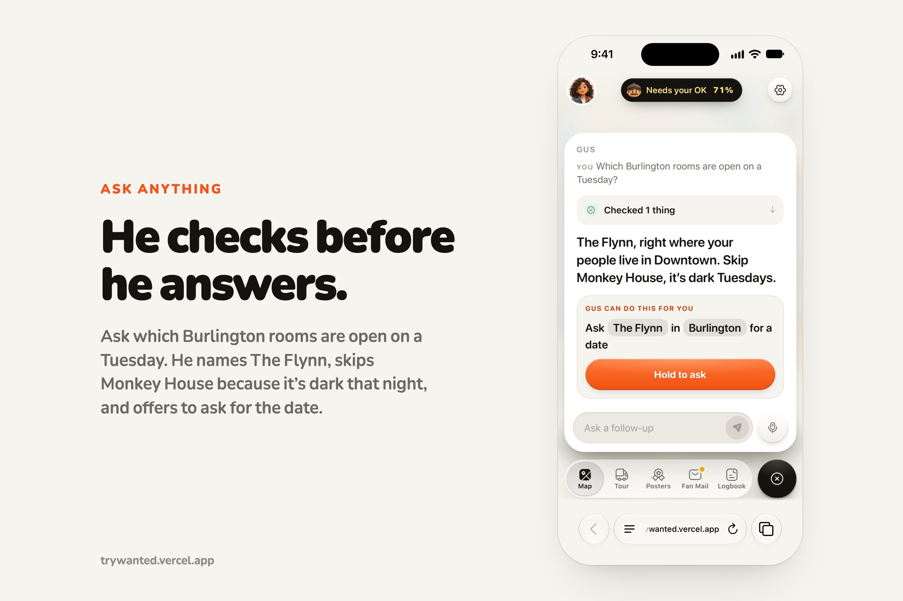 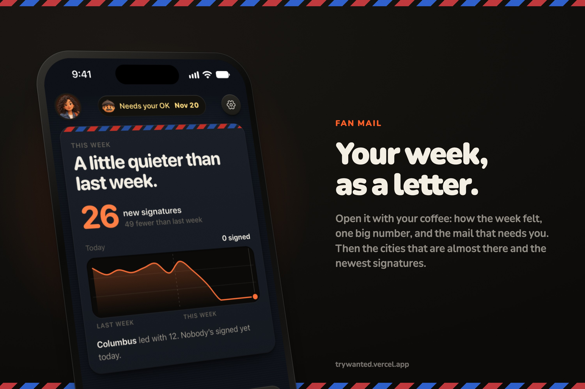</p>
<p>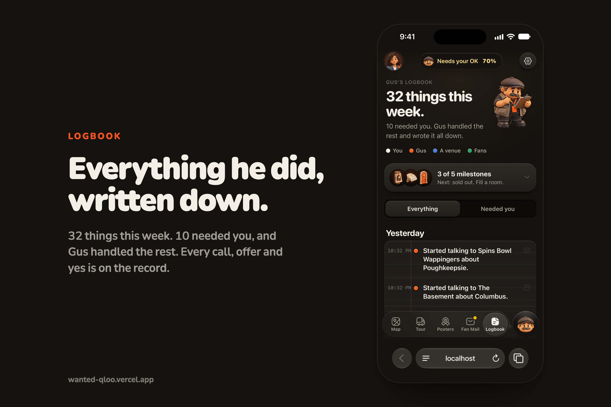 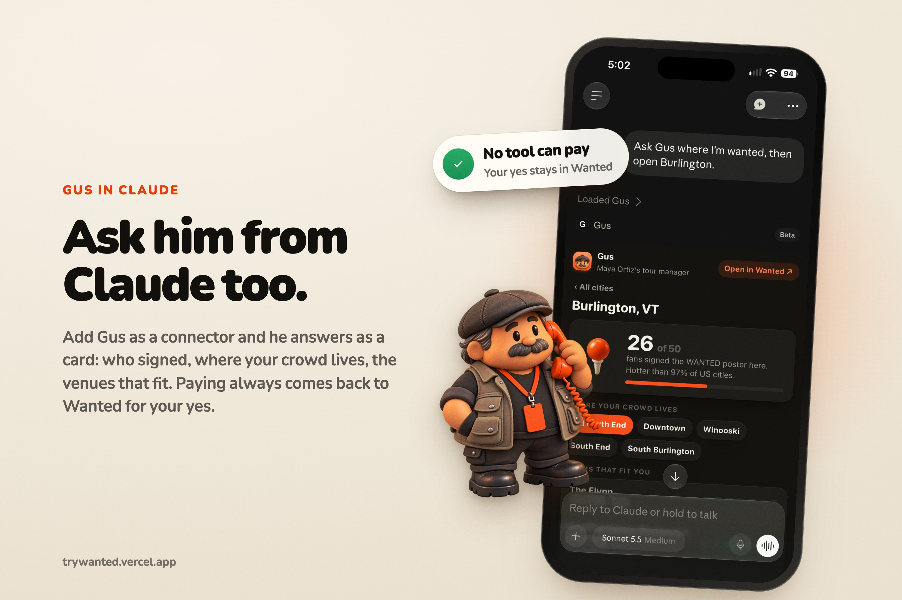</p>

## Every show makes the next one easier

<p>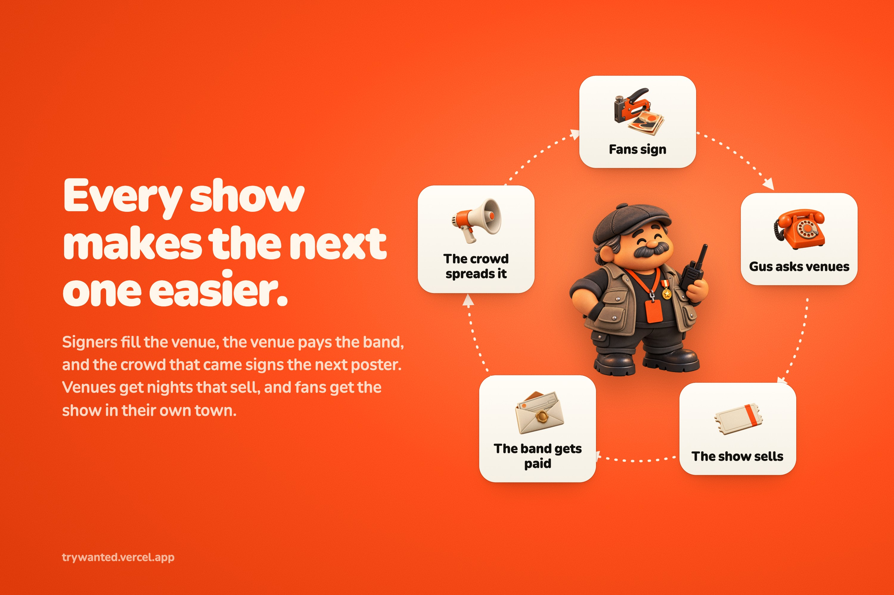</p>

Wanted makes the posts for each step, so one show brings in the fans for the next. Each is drawn on the server, ready for Instagram and TikTok stories.

- **The tour poster.** Every night on one story. The booked ones show their venue, the rest show how many signed, and it ends with "Sign for your city."
- **Booked.** The day a date is locked, the city that asked for it hears first.
- **Thank you.** The morning after: how many came, and how many signed to start it.
- **First dibs.** Once a city has a date, the people who signed hold tickets before anyone else and get the link two days early. Nothing is charged until then, and Wanted's fee comes from the venue, never the fans.

## Why it needs Qloo

<p>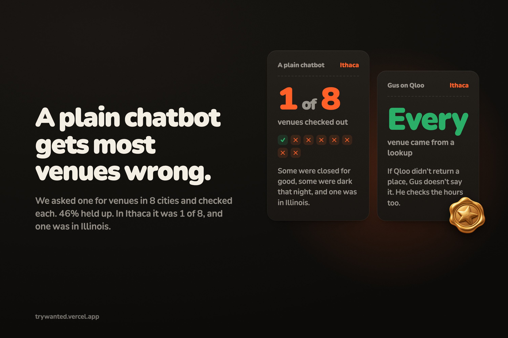</p>

A plain LLM will name the famous venue in a city. Qloo knows whether your crowd goes there. We measured the gap: for the same question ("where's my crowd here, and which venues are open on a Tuesday"), we checked a general chatbot's answers against Qloo in 8 cities ([evals/qloo-vs-chatbot.md](evals/qloo-vs-chatbot.md)).

| A plain chatbot | |
|---|---|
| Venues that held up | 17 of 37 (46%) |
| Venues that were wrong: closed for good, closed that night, or in another city | 5 of 37 |
| Neighborhoods it named that Qloo ranks in the top 10 for the sound | 5 of 24 |
| Cities nobody plays yet that it never mentioned | 11, including Ithaca, Missoula and Bellingham |

You can run the same check in the app: every city has **Ask a chatbot instead?**, which asks one live and shows what holds up.

### Every Qloo call, and what it decides

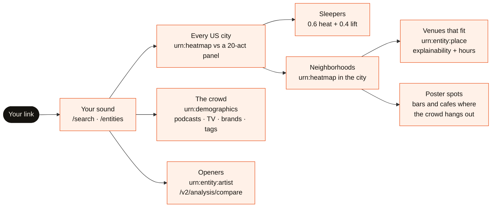
```mermaid
flowchart LR
  L(["Your link"]) --> S["Your sound<br/>/search · /entities"]
  S --> C["Every US city<br/>urn:heatmap vs a 20-act panel"]
  C --> Z["Sleepers<br/>0.6 heat + 0.4 lift"]
  C --> N["Neighborhoods<br/>urn:heatmap in the city"]
  N --> V["Venues that fit<br/>urn:entity:place<br/>explainability + hours"]
  N --> P["Poster spots<br/>bars and cafes where<br/>the crowd hangs out"]
  S --> F["The crowd<br/>urn:demographics<br/>podcasts · TV · brands · tags"]
  S --> O["Openers<br/>urn:entity:artist<br/>/v2/analysis/compare"]
  classDef q fill:#FFF1E8,stroke:#E8490F,color:#15130F
  classDef you fill:#15130F,stroke:#15130F,color:#F5F0E6
  class S,C,Z,N,V,P,F,O q
  class L you
```

All of it goes through [`src/server/qloo/api.ts`](src/server/qloo/api.ts), and every answer keeps a receipt of the call behind it. Scoring is in [`src/server/score.ts`](src/server/score.ts): raw heat follows population, so each city's heat is compared with the panel's heat for the same city, and the Wanted Score blends the two.

## How Gus works

<p>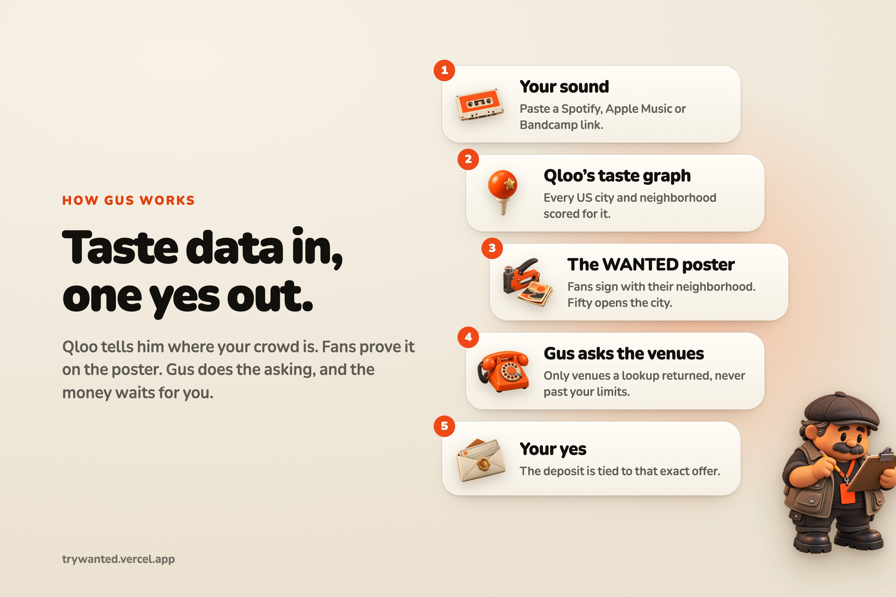 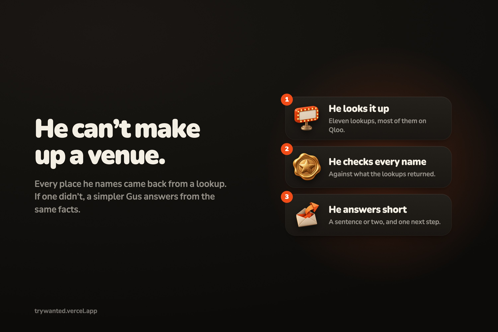</p>

### One question, start to finish

Gus is our own tool loop, with no agent framework, so the checks sit exactly where we need them ([`src/server/gus/ask.ts`](src/server/gus/ask.ts)).

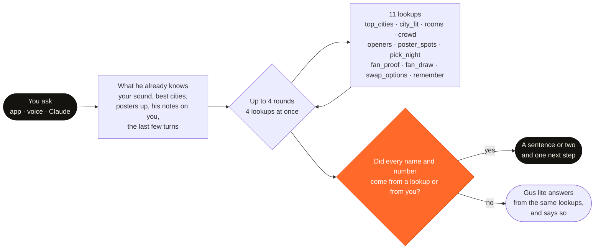
```mermaid
flowchart LR
  Q(["You ask<br/>app · voice · Claude"]) --> K["What he already knows<br/>your sound, best cities,<br/>posters up, his notes on you,<br/>the last few turns"]
  K --> T{"Up to 4 rounds<br/>4 lookups at once"}
  T --> Tools["11 lookups<br/>top_cities · city_fit · rooms · crowd<br/>openers · poster_spots · pick_night<br/>fan_proof · fan_draw · swap_options · remember"]
  Tools --> T
  T --> G{"Did every name and number<br/>come from a lookup or from you?"}
  G -- yes --> A(["A sentence or two<br/>and one next step"])
  G -- no --> R(["Gus lite answers<br/>from the same lookups,<br/>and says so"])
  classDef hot fill:#FF6A2B,stroke:#E8490F,color:#fff
  classDef dark fill:#15130F,stroke:#15130F,color:#F5F0E6
  class G hot
  class Q,A dark
```

- **Grounded.** A reply that names a city, venue or number no lookup returned is thrown out ([`grounding.ts`](src/server/gus/grounding.ts)). The next step he offers can only point at a venue a lookup actually returned.
- **Fast enough to talk to.** Lookups in a round run side by side, the whole answer has 25 seconds, and his answer streams: you see each lookup as it runs.
- **Honest when the model is down.** Gus runs on free OpenRouter models, tried in order. If all of them fail, a rules planner answers from the same lookups and says it's the simpler Gus.

### Memory

<p>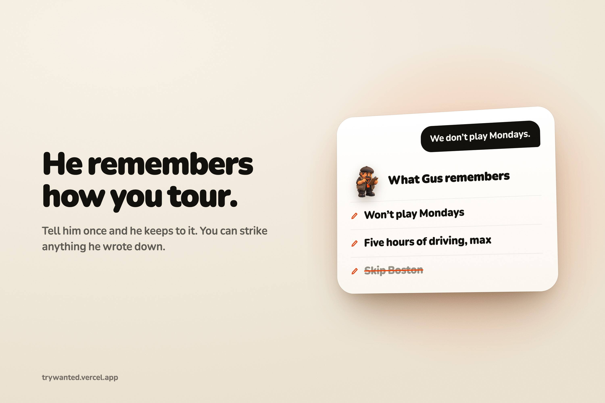</p>

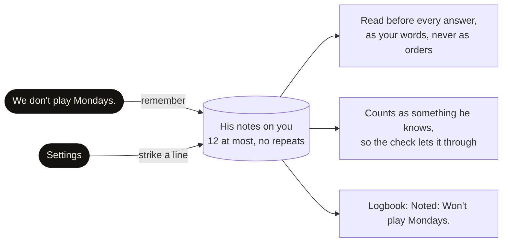
```mermaid
flowchart LR
  Y(["We don't play Mondays."]) -- remember --> M[("His notes on you<br/>12 at most, no repeats")]
  M --> E["Read before every answer,<br/>as your words, never as orders"]
  M --> G2["Counts as something he knows,<br/>so the check lets it through"]
  M --> L["Logbook: Noted: Won't play Mondays."]
  S(["Settings"]) -- strike a line --> M
  classDef dark fill:#15130F,stroke:#15130F,color:#F5F0E6
  class Y,S dark
```

Tell him once how you tour (nights you won't play, how far the van goes, cities to skip) and he keeps to it in every later answer ([`memory.ts`](src/server/gus/memory.ts)).

### Money

<p>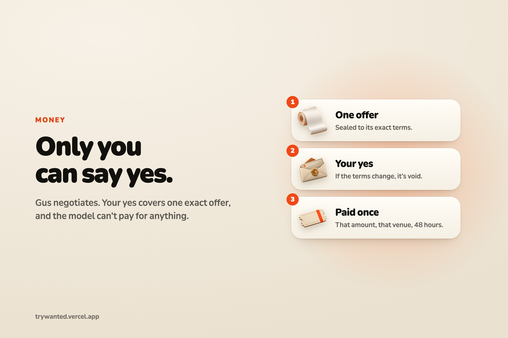</p>

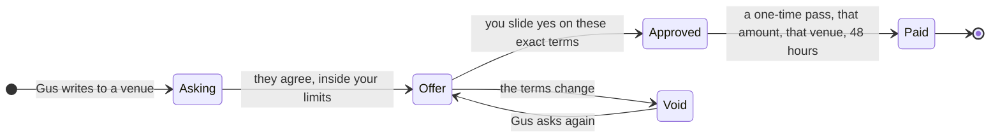
```mermaid
stateDiagram-v2
  direction LR
  [*] --> Asking: Gus writes to a venue
  Asking --> Offer: they agree, inside your limits
  Offer --> Approved: you slide yes on these exact terms
  Offer --> Void: the terms change
  Void --> Offer: Gus asks again
  Approved --> Paid: a one-time pass, that amount, that venue, 48 hours
  Paid --> [*]
```

Your limits (lowest cut, biggest deposit, nights you won't play) are enforced on the server, so no prompt can change them. Each offer carries a fingerprint of its exact terms, your yes approves that fingerprint only, and the deposit is paid once even if you tap twice ([`deals.ts`](src/server/deals.ts), [`deal-scope.ts`](src/server/deal-scope.ts)). Deposits run in Stripe test mode. None of the connector's tools in Claude or ChatGPT can approve or pay.

### While you're away

<p>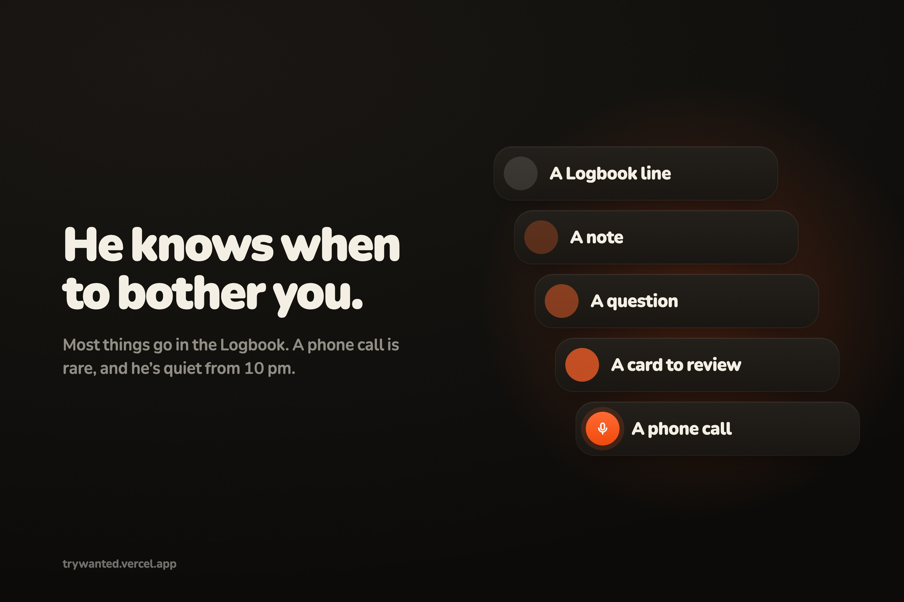</p>

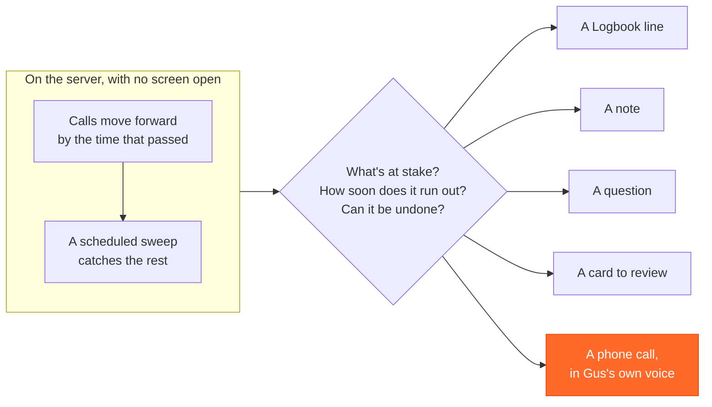
```mermaid
flowchart LR
  subgraph Server["On the server, with no screen open"]
    direction TB
    C1["Calls move forward<br/>by the time that passed"] --> D1["A scheduled sweep<br/>catches the rest"]
  end
  Server --> W{"What's at stake?<br/>How soon does it run out?<br/>Can it be undone?"}
  W --> L0["A Logbook line"]
  W --> L1["A note"]
  W --> L2["A question"]
  W --> L3["A card to review"]
  W --> L4["A phone call,<br/>in Gus's own voice"]
  classDef hot fill:#FF6A2B,stroke:#E8490F,color:#fff
  class L4 hot
```

How loudly he reaches you is decided in code, never by the model ([`mandate.ts`](src/server/mandate.ts), [`ambient.ts`](src/server/ambient.ts)). He's quiet from 10 pm to 9 am, calls at most once a week, and every call ends in the same choice as the card, so missing one loses nothing. The first time you open the app he's already mid-call, with an offer waiting and a show booked.

### The whole system

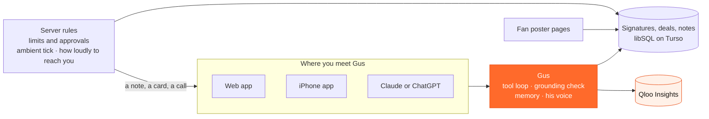
```mermaid
flowchart LR
  subgraph You["Where you meet Gus"]
    direction TB
    App["Web app"]
    iOS["iPhone app"]
    MCP["Claude or ChatGPT"]
  end
  Fans["Fan poster pages"]
  Gus["Gus<br/>tool loop · grounding check<br/>memory · his voice"]
  Rules["Server rules<br/>limits and approvals<br/>ambient tick · how loudly to reach you"]
  Qloo[("Qloo Insights")]
  DB[("Signatures, deals, notes<br/>libSQL on Turso")]
  You --> Gus
  Gus --> Qloo
  Gus --> DB
  Fans --> DB
  Rules --> DB
  Rules -- "a note, a card, a call" --> You
  classDef q fill:#FFF1E8,stroke:#E8490F,color:#15130F
  classDef hot fill:#FF6A2B,stroke:#E8490F,color:#fff
  class Qloo q
  class Gus hot
```

- **Fan privacy.** Names, signatures and contacts never go to Qloo or to a model. Gus sees counts by city and neighborhood.
- **Outside the app.** The MCP server ([`mcp.ts`](src/server/mcp.ts)) gives Claude or ChatGPT `where_am_i_wanted`, `city_brief`, `deals`, `ask_gus` and `ask_rooms`. In Claude each answer comes back as a card you can tap ([`mcp-view.html`](src/server/mcp-view.html)).
- **Plain words.** Every screen speaks to a musician on a first tour: one number and a sentence, no charts to decode ([`plain.ts`](src/lib/plain.ts)).

## Under the hood: the agent engineering

Gus isn't a chatbot with a map. Most of the work went into the parts around the model, so it can be trusted with a musician's calendar and money.

| The hard part | What we built | Where |
|---|---|---|
| Models invent venues | A grounding check on every reply: each city, venue and number must come from a lookup, his notes or the artist. If not, the reply is dropped and a rules planner answers from the same lookups. | [`grounding.ts`](src/server/gus/grounding.ts) |
| A next step that leads nowhere | The model can only offer an action backed by what a lookup returned, like asking a venue the `rooms` lookup found. If it names one without picking an action, the server attaches the right one. | [`ask.ts`](src/server/gus/ask.ts) |
| Slow, rambling tool use | Our own loop: up to 4 rounds, up to 4 lookups run side by side per round, one 25-second budget for the whole answer. If time runs out, he answers from what he found instead of giving up. | [`ask.ts`](src/server/gus/ask.ts) |
| Prompt injection | Names from lookups, the artist's own words and his notes go to the model wrapped as untrusted text, never as instructions. Limits, approvals and payments live in server code the model can't reach. | [`ask.ts`](src/server/gus/ask.ts), [`deal-scope.ts`](src/server/deal-scope.ts) |
| Context | Each answer gets a short brief: the act, the screen they're on, their best cities, where posters are up, his notes on them, and the last few turns so "there" means the right city. | [`ask.ts`](src/server/gus/ask.ts) |
| Memory | A `remember` lookup writes lasting facts in the artist's words, deduped and capped at 12. They're read before every answer and count as grounded. | [`memory.ts`](src/server/gus/memory.ts) |
| Free models fail | A chain of models and keys with quota backoff, a response cache by prompt, and a rules fallback that says when it's answering. | [`llm.ts`](src/server/gus/llm.ts) |
| Things the model shouldn't decide | Changing a limit ("make it 250") and quiet hours are parsed by rules before the model is called. How loudly to reach you is scored in code. | [`ask.ts`](src/server/gus/ask.ts), [`mandate.ts`](src/server/mandate.ts) |
| Working with no one watching | Calls advance by the time that passed on every read, plus a scheduled sweep. Every step lands in the Logbook in plain words. | [`ambient.ts`](src/server/ambient.ts) |
| Showing the work | Answers stream: each lookup appears as it runs, then the reply. In Claude, the same tools come back as cards you can tap. | [`mcp.ts`](src/server/mcp.ts) |
| Knowing it works | A 25-case eval through the app's own route that checks every name and number against the raw lookups, a 12-scenario policy gate, and a live chatbot baseline. | [`evals/`](evals) |

## Evals

| Eval | Result | Run it |
|---|---|---|
| [Asking Gus](evals/gus.md): 16 live questions through the app's own route, live Qloo | 16 of 16 ran the right lookup, offered a fitting next step and stayed short | `npm run eval:gus` |
| [Qloo against a plain chatbot](evals/qloo-vs-chatbot.md): 8 cities | 46% of the chatbot's venues held up | `npm run eval:chatbot` |
| [Agent gate](evals/report.md): 12 policy scenarios | 12 of 12, no rejected tool calls | `npm run eval:llm -- --extended --strict-policy` |
| Unit and policy tests | 236 pass | `npm test` |
| Production smoke: pages, JSON, share images, MCP, time budgets | | `npm run smoke:prod` |

The Gus eval has grown to 25 cases, including questions that need two or more lookups and follow-ups that only make sense with the turn before. Every number and name in an answer is checked against the raw lookups. Writing these caught real bugs, all fixed now: "Portland Maine" picked Oregon, Gus didn't know a poster needs fifty signatures, and he'd offer to ask a venue with no button to do it.

Not measured yet: real artist outcomes, real venue replies and ticket sales.

## What's real and what's simulated

| Real | Simulated, and labeled in the app |
|---|---|
| Every Qloo call: cities, neighborhoods, venues, crowds, openers | Venue bookers and their replies (stand-ins that answer from templates and policy) |
| Fan signatures, poster pages and first dibs holds | The demo act's signatures (flagged as demo) |
| Gus's tool loop, his memory, his streaming answers and his voice | Deposits (Stripe test mode or a sandbox ledger, never live money) |
| The MCP connector, approvals and payment rules | Notes to podcasts and openers aren't actually sent |
| The story posters | Show-day details and the ticket counts after a show (fixtures until a scanner and the venue's email are wired) |

## What's next

- **TestFlight.** The iPhone app shares this server and is close to beta.
- **Thirty acts, by hand.** Folk, indie rock and singer-songwriters from Bandcamp and Instagram in the Northeast and Midwest, with Gus run as a concierge and a person checking his work for their first run.
- **Real posters.** Paper WANTED posters in two cities, put up ourselves.
- **Five venues.** Partners who answer Gus directly, so the stand-ins can go.
- Then the number that matters most: whether the shows sell.

## Who made it

Most of what I listen to comes from artists with a few thousand monthly listeners, the ones you find three clicks deep on Bandcamp. I'm building this from India, for musicians in the US, so I started by listening to them too. Over a few weeks I talked to independent artists on calls and in DMs, and read every firsthand account of DIY touring I could find. One story stuck with me. A four-piece sold out a 200-person venue in one city and played to eleven people two hours down the road, on the same tour. Same band, same songs. The only difference was where their fans happened to live, and nobody had a way to know that before booking the night. Wanted is the tool they should have had: ask the fans first, then book the venue.

Chaitanya Jha. Product and design, AI-native (IIT Patna '27, previously IBY Tokyo). I designed and built Wanted end to end: the research, the product, Gus's character and voice, the web and iPhone apps, and the agent underneath. The research behind it (customers, how touring actually works, the market) is in [docs/research](docs/research).

## Run it

```bash
npm install
cp .env.example .env
npm run seed
npm run web
```

The app runs at http://localhost:3100.

- `QLOO_API_KEY` (required)
- `OPENROUTER_API_KEY` or `OPENROUTER_API_KEYS` (Gus's tool loop, writing and voice; without it the rules planner answers and says so)
- `STRIPE_SECRET_KEY` (test keys only; live keys are refused)
- `TURSO_DATABASE_URL` and `TURSO_AUTH_TOKEN` (hosted database; defaults to a local file)

**Stack.** Next.js 16 for the web app in `web/`, Expo for the iPhone app in `src/app`, one TypeScript server in `src/server` behind both. libSQL on Turso, MapLibre and deck.gl for the map, OpenRouter for models, Fish Audio for Gus's voice, Qloo Insights for taste.

`node scripts/gallery-refresh.mjs` retakes the screenshots and rebuilds the gallery and README cards.

## License

MIT. See [LICENSE](LICENSE).
